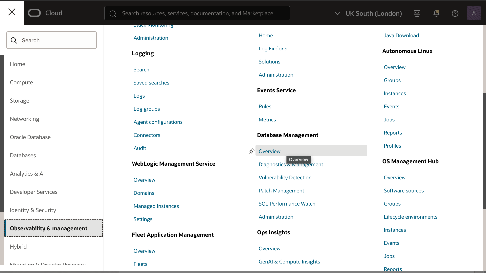
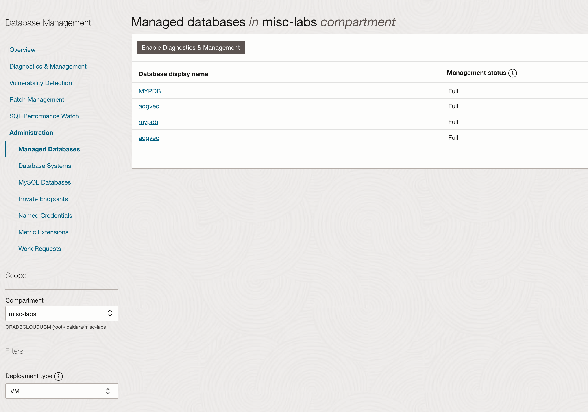
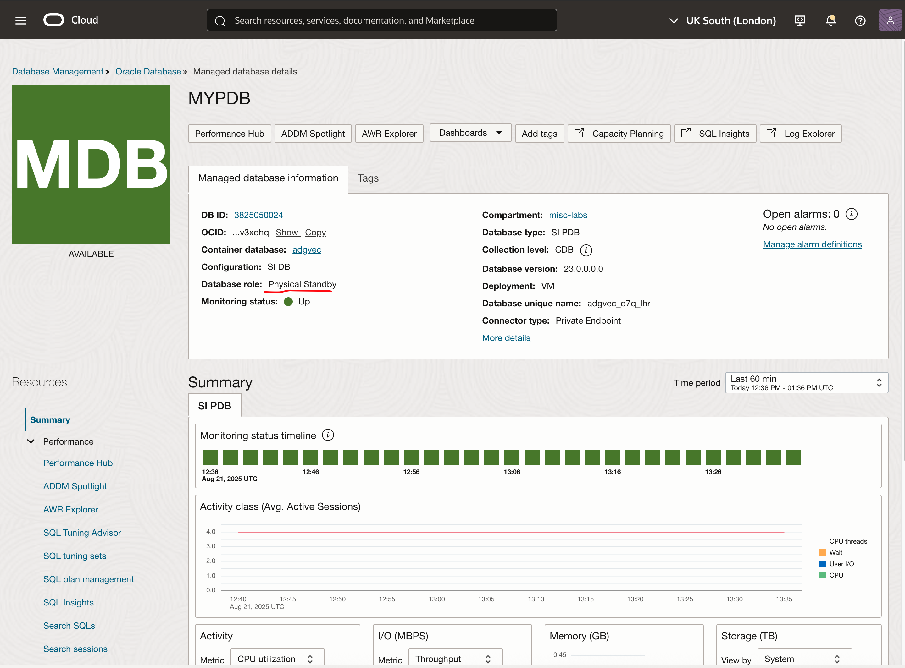
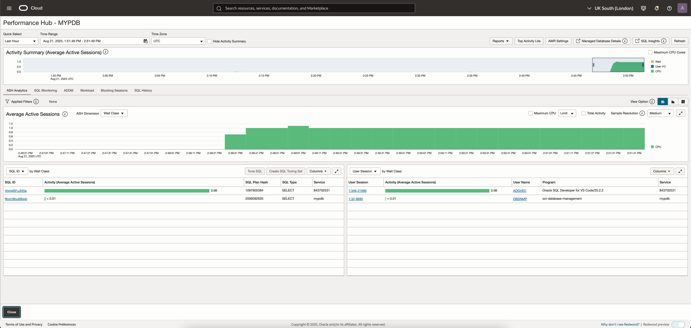

# Active Data Guard - AI Inferencing Demo

This lab uses a standby database with Active Data Guard to:

* Load images on the primary database
* Load an ONNX multi-modal model (text, images) on the primary database
* Run embedding generation on the standby database and insert the vectors through DML redirection
* Bonus: a React app allows searching images with semantic search

To demonstrate that the embedding generation doesn't run on the primary database, the primary and standby PDBs can be configured with Observability & Monitoring service to show the load happenind on the standby database. You can use any alternative method to verify the load happens on the standby instead of the primary (e.g. top, Enterprise Manager, ASH, select from v$session, etc.)

## Requirements

* An Oracle Cloud Infrastructure (OCI) tenancy with quotas for an Active Data Guard database
* A laptop or VM with:

  * **SQL Developer for VSCode**
  * A Python development environment on Linux (a must for OML4py)
  * Direct connectivity to the databases via SQL*Net (alternatively, you can configure tunneling if there's a jumphost or bastion, or use public endpoints)

## Content 

* `terraform/` — Infrastructure as Code (Terraform stack) to spin up the database with Active Data Guard
* `data/` — Image dataset with pets (cats or dogs) to be loaded in the database
* `src/init/` — Scripts to initialize the environment
* `src/schema/` — Scripts to create the empty schema and populate it with the images
* `src/embeddings/` — Scripts to generate the embeddings and do other operations like `select AI`
* `app/cat-search-backend/` - A Node.js Express backend to search images using Oracle Database's VECTOR_EMBEDDING and VECTOR_DISTANCE
* `app/cat-search-frontend/` - A React frontend to pass the search string and display the images

## Setup

### Initial database setup

1. Spin up the Terraform stack using `terraform/` . You can use your own stack or environment, as far as it is an Oracle Active Data Guard 23ai.
2. If the stack uses Clusterware:

    * Create the services `mypdb_ro` and `mypdb_rw` respectively for the Standby and Primary roles. Check `src/init/README.md` for more information.

    Otherwise:

    * Run the script `src/init/init_services.sql` to create startup triggers that start and stop the correct services depending on the role.

4. Run the script `src/init/unlock_dbsnmp.sql` to unlock the DBSNMP user that we''l use with the Observability service.

### Set up the schema

1. As `sys`, create the `adgvec` user with `src/schema/00-SYS-create-user.sql`
2. As `adgvec`, create the empty schema with `src/schema/01-ADGVEC-create-schema.sql`
3. Import the images:

    * With a remote client:
      Use the script `02-ADGVEC-import-images.py` to load them from your local laptop (see `src/schema/README.md`)
    * Using a local directory on the DB server:
      Create a directory where you put the images and load them with a PL/SQL (script not provided)

### Set up the Observability

* In the OCI console, go to **Menu -> Observability & management -> Database Management**

    

* The setup steps are not documented yet. It will require setting up dbsnmp and advanced diagnostic credentials.

* Once set up, open the databases and then click on the standby one (there's no way to tell them apart as far as I know)

    

    

### Create and load the ONNX models

* Open a connection as `sys` to `mypdb_rw` (you might need to set that up using tunnels)

  * Run `src/embeddings/00-SYS-create-directory.sql` to create the directory pointing to `$HOME/onnx`

* From a machine with `OML4py` installed, prepare the `clip` models from HuggingFace using `src/embeddings/01-prepare-model.py`

* Copy the generated models in the onnx directory on the primary

* Load the models using a connection as `adgvec` to `mypdb_rw` and running `src/embeddings/02-ADGVEC-load-model.sql`

## Run the Embedding Generation demo

### Generate the embeddings

* Create the embedding generation procedure using `src/embeddings/03-PRIMARY-ADGVEC-procedure-process-embeddings.sql`

* On the standby database, execute the procedure. An example is provided in `src/embeddings/04-STANDBY-ADGVEC-execute-procedure.sql`

    The result is that the standby session will saturate one CPU, generating the embeddings. That will give the time to show the CPU load on Observability Performance hub (or Enterprise Manager, etc.)
    

* (Optional) On the primary, you can create the vector index with `src/embeddings/05-PRIMARY-ADGVEC-create-hnsw-index.sql`

### Use AI Vector Search on the standby database

* The last script, `src/embeddings/06-STANDBY-ADGVEC-select-vector-distance.sql` can be used to query some data with semantic search

## Run the AI Vector search demo

### Configure and start the React application

The `app/` directory contains the React application to search images. Refer to [app/README.md](app/README.md) for the instructions.

